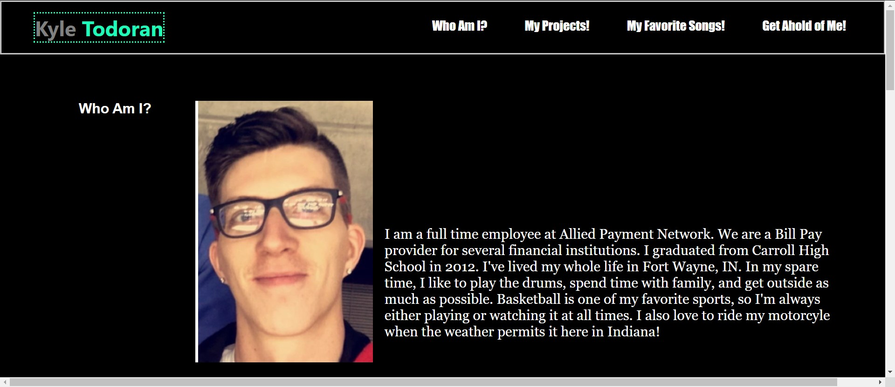

# My Portfolio

A Professional Portofolio About Me, Kyle Todoran!
    This is a landing page for my portfolio. You can check out my working projects that I've created so far, and find out what type of music I listen to, or just get ahold of me to chat sometime!
    
## Deployment

[Let's Go to My Portfolio](https://ktodoran.github.io) to view my portfolio.

## Usage

Future Companies and Employer's are welcome to view this page to find out what kind of work I have done, and can complete.

## Contributing
I am the only one Contributing to this page, as it is my personal and professional Portfolio in the making.

# My Portfolio

**My Repository does not have very many commit messages as I had been working and saving my work to an incorrect Repository and was not able to put the correct commit messages.**

Link to website: https://ktodoran.github.io/My-Portfolio/

This is a landing page for my portfolio. You can check out my working projects that I've created so far, and find out what type of music I listen to, or just get ahold of me to chat sometime!

There is a screenshot of the layout provided above! Feel free to take a look at its layout!

This file was created by me, Kyle Todoran!

If you have any suggestions or feel like I could style something a little better, or just want to give me some general feedback, shoot me an email at ktodoran@gmail.com! I would definitely appreciate it!